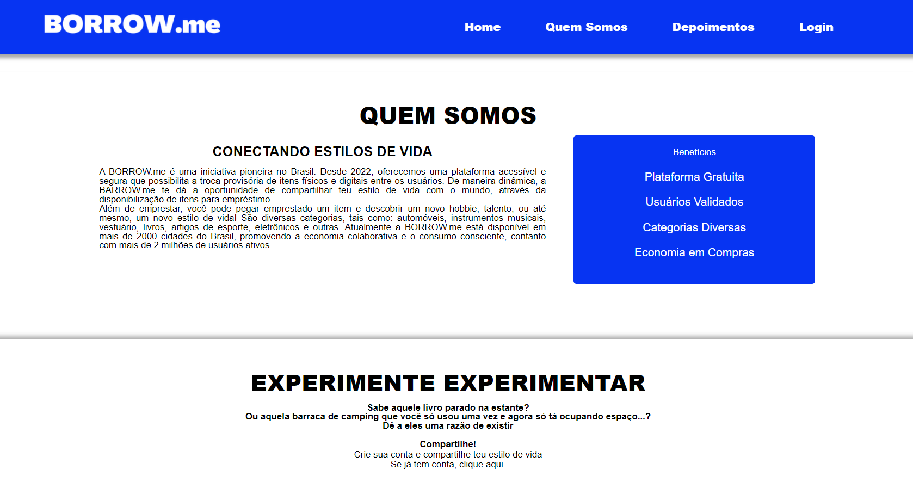

# Borrow.Me

**A Borrow.Me é um projeto fictício que visa conectar usuários interessados em descobrir novos estilos de vida e  possibilidades, através da ação de disponibilizar e/ou solicitar um item emprestado.** 

  

## Linguagens

  
  
  
  

  

## Tecnologias

    
    

  

## Habilidades Praticadas

-	Apache Server, padrão de requisição 
-	CRUD, blob e tratamentos de dados
-	GET, POST, requisições
-	Formulários com PDO
-	Autenticação e Validação de sessão
-	Desenvolvimento em grupo com Git

  

## A quem se destina

O público-alvo desta solução são todas as pessoas interessadas em disponibilizar seus pertences a terceiros, bem como, tomar emprestado pertences disponibilizados por outros usuários. 

Para ser usuário, é necessário ter 18 anos ou mais, ser registrado e ativo sob o Cadastro de Pessoa Física (CPF) e residir no Brasil.

  

## Screenshot

    
     
    <video style="width: 80%;" autoplay controls muted src="./to_readme/ScreenShot-video.mp4"></video>

  

## Principais Recursos

- Cadastro e gerenciamento de perfil de usuário

- Inclusão de pertences para disponibilização de empréstimo

- Gerenciamento de conta, com visibilidade dos produtos e serviços em uso

- Busca de produtos com filtragem

  

## Ferramentas de Terceiros

### Normalize

Folha de estilo de CSS com objetivo de entregar características visuais consistentes, independente do navegador.

### Google Fonts

API gratuita que disponibiliza fontes tipográficas.

### RDS Database da AWS

Banco de dados gratuito fornecido pela AWS, dentro da modalidade RDS, que entrega coleção de serviços gerenciadores de banco de dados.

  

## Disponibilidade

Por enquanto, este projeto não está hospedado em um servidor online.
Para utilizar, <a href="https://github.com/aa-abnerandrade/borrow_GerenciaEmprestimo/archive/refs/heads/release.zip" target="_blank"> baixe o repositório </a> e execute em sua máquina. O pacote conta com tabelas de demonstração para testes.

  

## Autoria

Este projeto foi desenvolvido em dupla durante os estudos da disciplina Programação Web, na PUC-PR.

    

 Abner Andrade 

 Vinícius Camargo 

